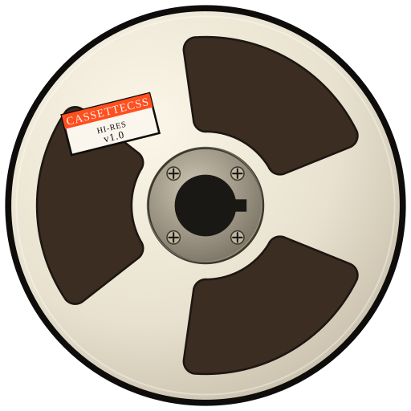

<div align="center">
  
  <h1>cassette<strong>css</strong></h1>
  <p>A brutalist UI framework with a hi-fi aesthetic.<br/>Warm paper tones, hard edges, and orange accent.</p>

  
  
  
</div>

---

## What is this?

Saw [Disk Cutter](https://antimatter-studios.github.io/diskcutter/) on Reddit and immediately wanted it as a CSS theme. CassetteCSS is the result — a component library built around that aesthetic: cassette-tape warmth, brutalist structure, and a strictly mechanical type stack.

## Features

- **Warm palette** — bone, paper, and ink tokens with a single orange accent
- **Hard shadows** — offset box-shadows, no blurs, no border-radius
- **Mono-first** — JetBrains Mono for UI chrome, Space Grotesk for display
- **Dark mode** — manual toggle, opt-in only (no OS preference override)
- **JS plugins** — Accordion, Dropdown, Modal, and CustomSelect with a consistent API
- **SCSS architecture** — tokens, reset, layout, grid, and components as separate partials

## Components

| Component | Class | Plugin |
|---|---|---|
| Buttons | `.btn` `.btn-primary` `.btn-static` | — |
| Cards | `.card` `.card-flush` | — |
| Alerts | `.alert` `.alert-error` | — |
| Labels | `.label` `.label-accent` | — |
| Accordion | `.accordion` `.accordion-flush` | `Accordion` |
| Dropdown | `.dropdown` `.dropdown-split` | `Dropdown` |
| Modal | `.modal` `.modal-sm` `.modal-lg` | `Modal` |
| Custom Select | `select[data-fw-component="custom-select"]` | `CustomSelect` |
| Table | `.table` `.table-wrap` | — |
| Progress | `.progress` `.is-striped` `.is-indeterminate` | — |
| Hazard | `.is-hazard` | — |

## Usage

```html
<!-- Link the compiled CSS -->
<link rel="stylesheet" href="dist/cassettecss.css" />

<!-- Or import in JS -->
<script type="module" src="dist/cassettecss.es.js"></script>
```

```html
<!-- Button -->
<button class="btn btn-primary">Deploy</button>

<!-- Custom Select -->
<select data-fw-component="custom-select" name="env">
  <option value="prod">Production</option>
  <option value="staging">Staging</option>
</select>

<!-- Accordion -->
<div data-fw-component="accordion" class="accordion-item">
  <h3 class="accordion-header">
    <button class="accordion-btn">Section title
      <span class="accordion-chevron material-symbols-outlined">expand_more</span>
    </button>
  </h3>
  <div class="accordion-body">Content goes here.</div>
</div>
```

## JS API

All plugins share the same pattern:

```js
// Auto-init on DOMContentLoaded (happens automatically)
CustomSelect.init()

// Get an instance
const select = CassetteCSS.CustomSelect.getInstance(el)
select.getValue()
select.setValue('staging')
select.open()
select.destroy()

// Events
el.addEventListener('fw:select:change', e => {
  console.log(e.detail.value, e.detail.text)
})
```

## Development

```bash
npm install
npm run dev      # kitchen sink dev server
npm run build    # compile to dist/
```

## Stack

- [Vite](https://vitejs.dev/) — build tooling
- [Sass](https://sass-lang.com/) — SCSS compilation
- Inspiration: [Disk Cutter](https://antimatter-studios.github.io/diskcutter/) by Antimatter Studios

---

<div align="center">
  <sub>Built with <a href="https://claude.ai/code">Claude Code</a> · Sonnet 4.6</sub>
</div>
